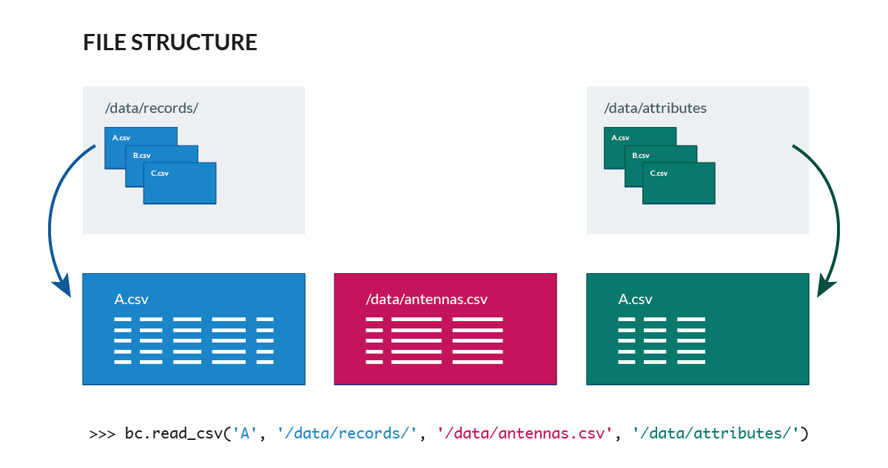

Quick start
===========

Installation
------------
The easiest way to install it is using PyPI::

        pip install bandicoot

Alternatively, you can download it from `here <https://github.com/yvesalexandre/bandicoot/archive/master.zip>`_. Once unzipped you can either import it ``import bandicoot as bc`` or install it::

        python setup.py install

Loading data
------------
bandicoot takes one file per user and assume that all user records are in the provided directory `records/`:

>>> B = bc.read_csv('my_user', 'records/', 'antennas.csv')

This :meth:`~bandicoot.io.read_csv` will load records for the user `my_user` from `records/my_user.csv` and will load antennas from the file `antennas.csv`. Optionally, bandicoot can also load a file containing :ref:`attributes <attributes-label>` for this user.

bandicoot uses one record file per user.  Record files are structured as follows:

=========== ========= ================ =================== ============= ===========
interaction direction correspondent_id datetime            call_duration antenna_id
=========== ========= ================ =================== ============= ===========
call        in        8f8ad28de134     2012-05-20 20:30:37 137           13084
call        out       fe01d67aeccd     2012-05-20 20:31:42 542           13084
text        in        c8f538f1ccb2     2012-05-20 21:10:31               13087
=========== ========= ================ =================== ============= ===========

records.csv::

  interaction,direction,correspondent_id,datetime,call_duration,antenna_id
  call,in,8f8ad28de134,2012-05-20 20:30:37,137,13084
  call,out,fe01d67aeccd,2012-05-20 20:31:42,542,13084
  text,in,c8f538f1ccb2,2012-05-20 21:10:31,,13087

while the antennas file contains the latitude and longitude coordinates of the antennas::

  antenna_id,latitude,longitude
  13084,42.360888,-71.0877297
  13087,42.367709,-71.107692

Computing indicators
--------------------

The behavioral indicators can be computed by individual functions such as :meth:`~bandicoot.individual.response_rate_text` and :meth:`~bandicoot.spatial.radius_of_gyration` or by using :meth:`~bandicoot.utils.all` which returns all the indicators defined in :doc:`reference/bandicoot.individual` and :doc:`reference/bandicoot.spatial`.

  >>> B = bc.tests.sample_user()  # Load a sample user
  >>> bc.utils.all(B)
  OrderedDict({'name': 'sample_user',
    'reporting': OrderedDict({'antennas_path': None,
    'groupby': 'week',
    'split_week': false, 
    'split_day': false, 
    'start_time': '2012-01-01 00:55:56',
    'end_time': '2014-11-27 00:31:44',
    ...,
    'call_duration': {
        'allweek': {
            'allday': {
                'call': {
                    'std': {
                        'std': 0.0, 
                        'mean': 202.5
                    }, 
                    'mean: {
                        'std': 0.0, 
                        'mean': 339.5
                    }
                }
            }
        }
    }, ,
    ...
    'percent_initiated_interactions': {
        'allweek': {
            'allday': {
                'call': {
                    'std': 0.0, 
                    'mean': 0.5
                }
            }
        }
    },
    ...
    'radius_of_gyration': {
        'allweek': {
            'allday': {
                'std': 0.0, 
                'mean': 1.2777217936866738
            }
        }
    },
    'frequent_antennas': {
        'allweek': {
            'allday': {
                'std': 0.0, 
                'mean': 1.0
            }
        }
    }})

:meth:`~bandicoot.utils.all` returns a nested dictionary with all indicators (:doc:`reference/bandicoot.individual`, :doc:`reference/bandicoot.spatial`) and some reporting metrics (the name of the user, ``groupby``, the ``version`` of bandicoot used, the number of ``records_missing_locations``, etc)

By default, bandicoot computes the indicators on a **weekly basis** over all the weeks for which data is available. The indicators from each week are computed, and their averages and standard deviations are returned. bandicoot defines weeks as beginning on a Monday and ending on a Sunday.  The parameter ``groupby=None`` can be used to compute the indicators over the entire timeframe instead.

.. image:: _static/mini-mockups-02.png

Note that, while some indicators return a mean and a std per time period (e.g., each week), others return only one value. For example, :meth:`~bandicoot.individual.percent_initiated_interactions` and :meth:`~bandicoot.individual.active_days` return only one value per time period, the percentage of interactions initiated by the user and the number of days he has been active. Others, such as :meth:`~bandicoot.individual.call_duration` will return the mean and std of the value over the time period (28 seconds on average with a standard deviation of 19.7 seconds for the first week). If passed ``summary=extended``, bandicoot will also return the median, min, max, kurtosis, and skewness (among the values from each time period)::

  >>> bc.individual.call_duration(B, groupby=None)
  {'allweek': {'allday': {'call': {'mean': 521.652528548124,
    'std': 294.98456007533633}}}}
  >>> bc.individual.call_duration(B, summary='extended', groupby=None)
  {'allweek': {'allday': {'call': {'kurtosis': 1.7522977930497714,
    'max': 1000.0,
    'mean': 521.652528548124,
    'median': 532.0,
    'min': 1.0,
    'skewness': -0.07157493958994408,
    'std': 294.98456007533633}}}}

``summary=extended`` can also be passed to :meth:`~bandicoot.utils.all`::

    >>> bc.utils.all(B, summary='extended', flatten=True)
    {
        "name": "sample_user",
        ...
        "call_duration__allweek__allday__call__std__std": 14.111679981502093,
        "call_duration__allweek__allday__call__std__mean": 291.9860252840037,
        "call_duration__allweek__allday__call__skewness__std": 0.2327813923167136,
        "call_duration__allweek__allday__call__skewness__mean": -0.14905391966308995,
        "call_duration__allweek__allday__call__min__std": 36.765336935760565,
        "call_duration__allweek__allday__call__min__mean": 30.9,
        ...
    })
 

Exporting indicators
--------------------

Once computed using :meth:`~bandicoot.utils.all`, the indicators of one or seveval users can be easily exported using :meth:`~bandicoot.io.to_csv` and :meth:`~bandicoot.io.to_json`.

   >>> bc.io.to_csv([bc.utils.all(user, groupby=None) for user in [B, other_user]], "bandicoot_indicators.csv")
   Successfully exported 2 objects to bandicoot_indicators.csv

will flatten the dictionaries and write the indicators in a CSV file with a header and one line per user::

    name,reporting__antennas_path,reporting__attributes_path,reporting__version,reporting__grouping_method,reporting__start_time,reporting__end_time,reporting__bins,reporting__has_call,reporting__has_text,reporting__has_home,reporting__percent_records_missing_location,reporting__antennas_missing_locations,reporting__percent_outofnetwork_calls,reporting__percent_outofnetwork_texts,reporting__percent_outofnetwork_contacts,reporting__percent_outofnetwork_call_durations,reporting__nb_records,reporting__ignored_records__all,reporting__ignored_records__interaction,reporting__ignored_records__correspondent_id,reporting__ignored_records__call_duration,reporting__ignored_records__direction,reporting__ignored_records__datetime,active_days__callandtext,number_of_contacts__text,number_of_contacts__call,call_duration__call__std,call_duration__call__mean,percent_nocturnal__text,percent_nocturnal__call,percent_initiated_conversations__callandtext,percent_initiated_interactions__call,response_delay_text__callandtext__std,response_delay_text__callandtext__mean,response_rate_text__callandtext,entropy_of_contacts__text,entropy_of_contacts__call,balance_of_contacts__text__std,balance_of_contacts__text__mean,balance_of_contacts__call__std,balance_of_contacts__call__mean,interactions_per_contact__text__std,interactions_per_contact__text__mean,interactions_per_contact__call__std,interactions_per_contact__call__mean,interevent_time__text__std,interevent_time__text__mean,interevent_time__call__std,interevent_time__call__mean,percent_pareto_interactions__text,percent_pareto_interactions__call,percent_pareto_durations__call,number_of_interactions__text,number_of_interactions__call,number_of_interaction_in__text,number_of_interaction_in__call,number_of_interaction_out__text,number_of_interaction_out__call,number_of_antennas,entropy_of_antennas,percent_at_home,radius_of_gyration,frequent_antennas
    sample_user,,,0.2.3,,2012-01-01 00:55:56,2014-11-27 00:31:44,1,True,True,True,0.0,0,0,0,0,0,1960,0,0,0,0,0,0,800,150,149,288.20204,509.09016,0.9065,0.91803,0.50813,0.48873,,,0.0,4.92907,4.9139,0.00175,0.00339,0.00196,0.00328,2.5961,6.56,2.73048,6.55034,110028.24,88312.70905,107264.44395,88859.44308,99,96,94,984,976,484,499,500,477,7,1.94257,0.15508,1.53683,6
    other_user,...

Full pipeline
-------------

The following code will load all the users in one directory, compute the indicators, and export them to a csv file::

   >>> import bandicoot as bc
   >>> import glob, os
   
   >>> path_dir = 'users/'
   >>> antenna_file = 'antennas.csv'
   
   >>> indicators = []
   >>> for f in glob.glob(records_path + '*.csv'):
   >>>     user_id = os.path.basename(f)[:-4]

   >>>     try:
   >>>         B = bc.read_csv(user_id, records_path, antenna_file, describe=False)
   >>>         metrics_dict = bc.utils.all(B)
   >>>     except Exception as e:
   >>>         metrics_dic = {'name': user_id, 'error': True}

   >>>     indicators.append(metrics_dict)

   >>> bc.io.to_csv(indicators, 'bandicoot_indicators_full.csv')

The full pipeline file is available `here <https://github.com/yvesalexandre/bandicoot/blob/master/sample_code/full_pipeline.py>`_. A parallel version using `MultiProcessing <https://docs.python.org/2/library/multiprocessing.html>`_ is available `here <https://github.com/yvesalexandre/bandicoot/blob/master/sample_code/full_pipeline_mp.py>`_.

